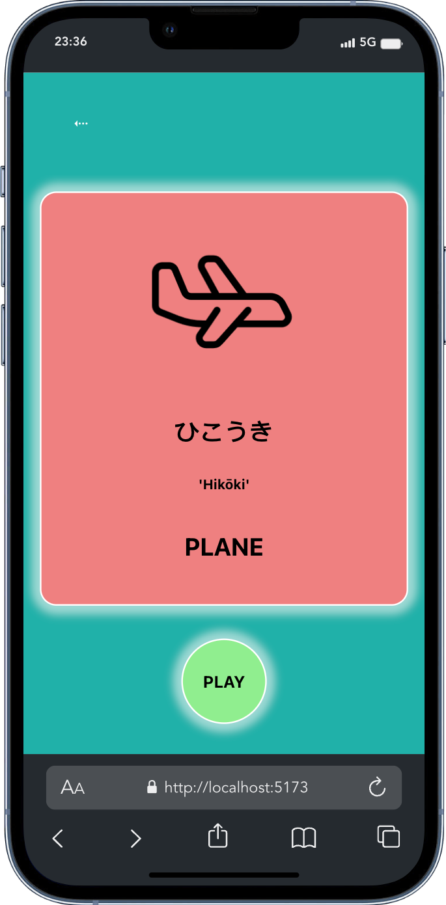
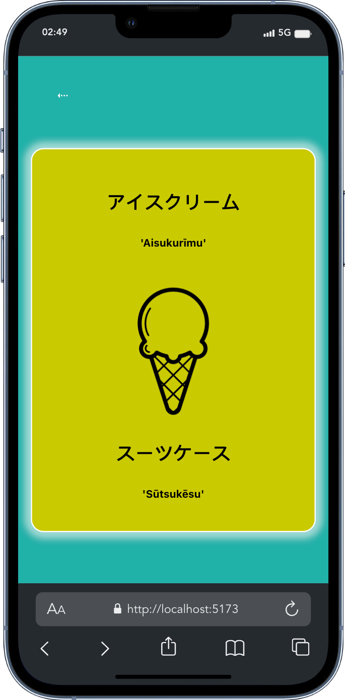
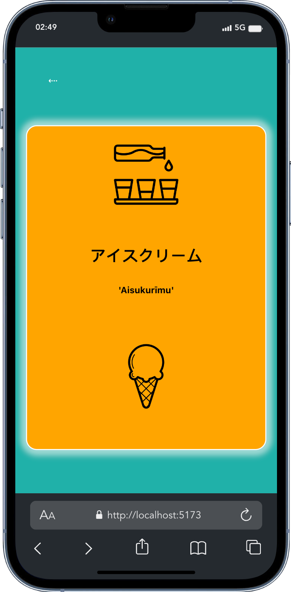
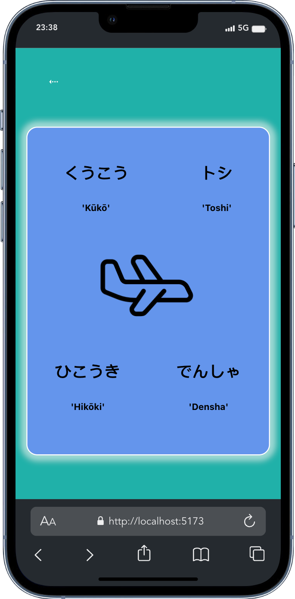
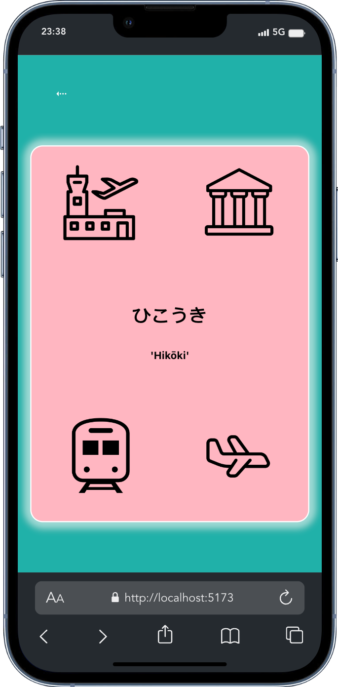
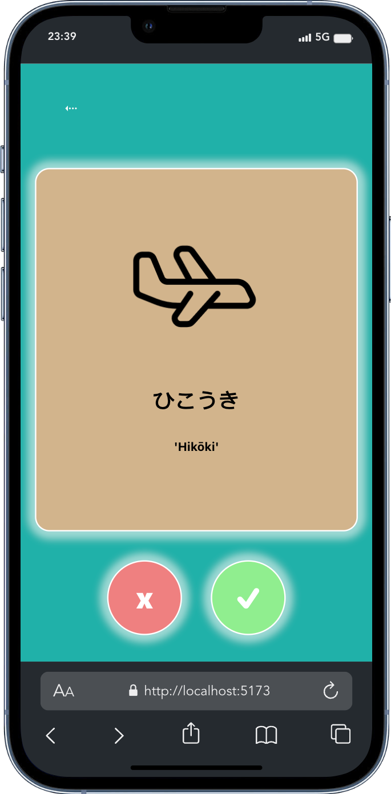
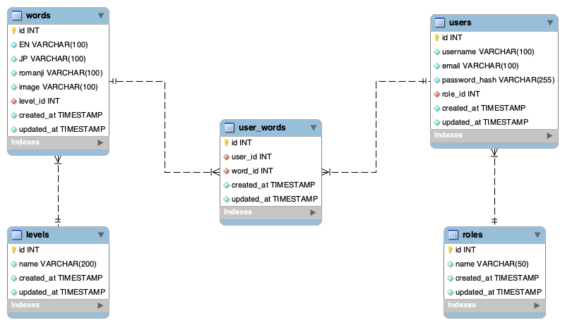

# TAPS - Language Learning Program

This is the FINAL PROJECT of the Full Stack Development Bootcamp with <a href="https://github.com/GeeksHubsAcademy" target="_blank">Geekshubs Academy</a>.


<hr/>

<div align="center">
    
    
    
    
    
    
</div>


<hr/>

<details>
  <summary>Table of Contents</summary>
  <ol>
    <li><a href="#idea-overview">Idea</a></li>
    <li><a href="#general-features">Features</a></li>
    <li><a href="#database-diagram-mysql">Database diagram</a></li>
    <li><a href="#instalation-local">Instalation</a></li>
    <li><a href="#credentials">Credentials to explore the app</a></li>
    <li><a href="#pages">Endpoints / Pages</a></li>
    <li><a href="#app-views-mobile-first">APP VIEWS</a></li>
    <li><a href="#deployment">Deployment</a></li>
    <li><a href="#author">Author / Contact </a></li>
  </ol>
</details>

<hr/>


## Idea overview
This is a language learning program (mobile first) designed to help users learn and practice Japanese vocabulary in an enjoyable and engaging way. 
The program provides various types of word quizzes, pictogram and word recognition, and progress tracking to enhance the learning experience. It gives instant feedback on your progress.

## How the game works

#### Stay Motivated
Easily form a language learning habit with the game-based features and enjoyable challenges with perfect level and pace for you.

#### Effective and Fun Learning Games
With Taps, learning becomes playtime. Engaging games, review modes, and interactive challenges transform language acquisition into a joyful experience.

#### Memorable Illustrations
Boost your memory retention with our captivating visuals and vibrant and soothing colors. Each word is accompanied by an eye-catching image, forging strong associations between the word and its meaning. Say hello to seamless language recall!
  

  <div float="left">

<p>


  </p>
</div>


## General features

- Word Quizzes: Users can take quizzes to test their knowledge of vocabulary words.
- Flashcards: Flashcards are available to help users memorize vocabulary.
- Progress Tracking: The program tracks user progress to monitor learning achievements.
- Admin Panel: Administrators can manage users, words and levels in the program.


## Mini-games:
- Learning: the word and symbol appear (tap to continue).
- Compare 2 words (only one matches the symbol).
- Compare 2 symbols (only one matches the word).
- Compare 4 words (only one matches the symbol).
- Compare 4 symbols (only one matches the words).
- Display word AND symbol (is it true or false?).


## Project MVP (just for the Front-end part)
- Use of REDUX
- Complex project structure: Hooks, Components, Services
- Modularized CSS (separated files)
- SPA (use of react-router-dom)
- Register / Login / Editable Profile views
- Views tha consum all endpoints from backend (at least 2 full CRUDs)


## LOGIC BEHIND THE GAME

The game (for now) consists of 50 words, divided in 5 levels of 10 words each.

This is important as for each level the game plays around these 10 words only, before passing onto the next one.

1- first screen shows us the „WORD AT PLAY”. We can read all the options:
	- symbol
	- English word
	- Japanese word
	- Romanji word (romanised version of the Japanese word)

2- second screen shows us the symbol and 2 written words to choose from (the correct one and one to divert)
	This second „WORD TO DIVERT” comes randomly from the other 9 words of the current level.

3- third screen is a variation of the second screen. 
	A written word (in Japanese and Romanji) is accompanied with 2 different symbols to choose from.

4- fourth screen offers 4 options (3 words to divert plus the corresponding word).
	The 3 words for diversion come as well from the other 9 of the same level.

5- fifth switches words and symbols in the fourth.

6- and last offers a symbol and a Japanese word.
	TRUE or FALSE options to choose from.
<div float="left">
<p>






</p>
</div>
<details>

<summary>read more</summary>

It is ensured that within the random words to divert, same word is not offered twice.
The position of the correct answer within the different options changes „randomly” (meaning using module of 2 and 3)
Same happens with the last True/False screen.


FOR NOW, the last screen decides if the word is learnt of not.
	- if answered correctly, the word is added to the LEARNT WORDS list (that each user has: table UserWord in DataBase) 
	- securing it down in the database, we can make sure that the progression during the game is saved despite the user login out or even changing phones/computers.
	- game continues with first screen (offering the next word)

	- if answered incorrectly, it loops back to first screen offering again the whole set of screen with the same word, until answered correctly.

WHAT HAPPENS AFTER LEVEL IS COMPLETED?
	- once the user has played and successfully learnt 10 words from a level, a congratulation screen is displayed, informing user of the progress: which level was accomplished and how many left till end of game.
	- after the pause, player can keep on learning.

</details>

<details>
<summary>FUTURE FEATURES</summary>

WHY have I said „for now”?
	- Well, because of time constraints (this project was due in a limited less than 2 weeks period and the MVP included other things, back and frontend related. 
	So the strategy behind was to create a simple module that made sense and was scalable, to keep on developing afterwards. For instance:

		- I would like to add other versions of the screens (where no Romanji is offered - so that Japanese letter recognition is reinforced)
		- Also different type of challenges where spelling and slices of arrays are to be put in order to pass the level.
		- I would also like to add the audio feature, where the word has a short clip with the sound of the word. It would be offered together with the concept, and also after every successful answer.
		- Time constraint. Setting up a time limit would force user to focus on the game, in an engaging way, let’s call it „healthy addiction”.

</details>

## Database diagram (MySQL)
<div align="center">


</div>

## Instalation (local)
1.  Clone this repository: 
`$ git clone https://github.com/SergioTorresGarcia/TAPS_frontend_language-learning-app.git`
2.  Navigate to the project directory `$ cd project-name`
3.  Install dependencies: run ` $ npm i ` in terminal

<p>⚠️ MAKE SURE THAT BACKEND & DATABASE ARE RUNNING AS WELL ⚠️</p>
⚠️ & you've set up all environment variables accordingly ⚠️</p>

4.  Once both back and front-end are running, start server with ` $ npm run dev ` in terminal and access the application (http://localhost:5173/)

5.  This is a mobile first app, so for a better experience, select mobile view in your browser's  developer console:

> Option + ⌘ + J (on macOS)

> Shift + CTRL + J (on Windows/Linux)

6.  Enjoy & learn!


## CREDENTIALS

1. Register/login yourself and start playing.

2. Sign in as 'user' and play for a while. Remember to check out the rules of the game, your progress, and try deleting your profiles if you wish:

```bash
{
    "email": "user@mail.com",
    "password": "Aa123456"
}
```

3. Signing in as 'admin' you'd have access to extra functionalities in the admin panel:
- Roles CRUD
- Users CRUD
- Levels CRUD
- Words CRUD

```bash
{
    "email": "admin@mail.com",
    "password": "Aa123456"
}
```


## PAGES
<details>
<summary>URLs</summary>

- from LANDING: http://localhost:5173/
    > LOGIN http://localhost:5173/login
    
    > REGISTER (Create user) http://localhost:5173/register

- from PROFILE check:
    > RULES (if you need) http://localhost:5173/rules
    > PROGRESS (if you want) http://localhost:5173/progress
    > EDIT PROFILE (if you must) http://localhost:5173/profile/me
    > DELETE PROFILE (if you dare!) http://localhost:5173/delete-profile

- from HOME:
    > GAME http://localhost:5173/play
    > PROFILE http://localhost:5173/profile/me
    > LOG OUT (it'd save position in the game)

- from GAME (loop):
    > PLAY http://localhost:5173/play
    > PLAY2 http://localhost:5173/play2
    > PLAY2a http://localhost:5173/play2a
    > PLAY3 http://localhost:5173/play3
    > PLAY4 http://localhost:5173/play4
    > PLAY5 http://localhost:5173/play5

    > CONGRATS view (after 10 words learnt) http://localhost:5173/play/congrats

- from HOME (as Admin):
    > GAME / PROFILE / LOG OUT

    > ADMIN http://localhost:5173/admin

- from ADMIN PANEL:
    > ROLES Create / Read / Delete http://localhost:5173/admin/roles
    > USERS Read http://localhost:5173/admin/users
    > LEVELS Create / Read / Delete http://localhost:5173/admin/levels
    > WORDS Read / Delete http://localhost:5173/admin/words
    
    > NEW WORD Create http://localhost:5173/admin/words/new
</details>


## APP VIEWS (mobile first)
<div float="left">
  <p>GAME SCREENS</p>
  <p>
  
  
  
  
  
  </p>
  <p>
  
  
  
  
  </p>

<details>
<summary>LANDING / REGISTER / LOGIN / HOME</summary>
<p>
  
  
  
  
  </p>
  </details>

  <details>
  <summary>PROFILE / RULES / PROGRESS / DELETE PROFILE</summary>
  <p>
  
  
  
  
  </p>
  </details>

  <details>
  <summary>ADMIN PANEL / ROLES / USERS / LEVELS / WORDS</summary>
  <p>
  
  
  
  </p>
  <p>
  
  
  
  
  </p>
</details>

  <p>VIEWS ON THE COMPUTER SCREEN</p>
  <p>
  
  
  
  
  </p>
  <p>
  
  
  
  
  </p>
</div>


## Deployment

https://master.dvdetud9ckjiz.amplifyapp.com/


## Author
<div align="center">
<a href = "mailto:a.sergiotorres@gmail.com">

</a>
<a href="https://github.com/SergioTorresGarcia" target="_blank">

</a> 
<a href="https://www.linkedin.com/in/s-t-g/" target="_blank">

</a> 
</div>
